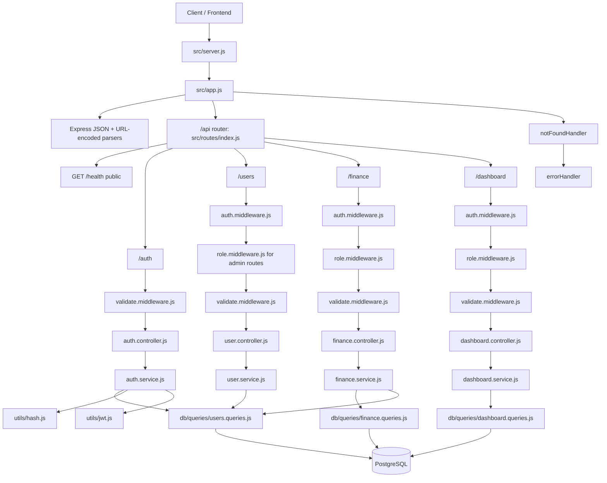
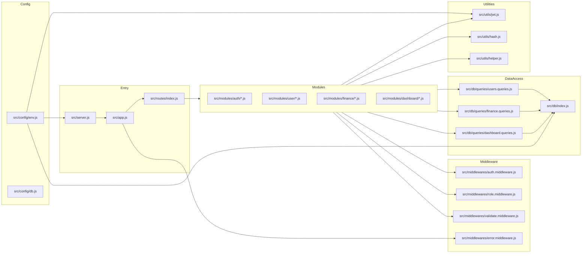

# Backend Flowchart and File Map

This document shows how requests move through the backend and how files are organized.

## 1) Request Lifecycle (High-Level)

## 2) File Responsibility Map

## 3) Endpoint to File Trace

- `POST /api/auth/register` -> `modules/auth/auth.routes.js` -> `auth.controller.register` -> `auth.service.register` -> `users.queries` + `hash` + `jwt`.
- `POST /api/auth/login` -> `modules/auth/auth.routes.js` -> `auth.controller.login` -> `auth.service.login` -> `users.queries` + `hash` + `jwt`.
- `GET /api/users/me` -> `modules/user/user.routes.js` -> `auth.middleware` -> `user.controller.getCurrentUser` -> `user.service.getCurrentUser` -> `users.queries.getUserById`.
- `Users admin CRUD` -> `modules/user/user.routes.js` -> `auth.middleware` + `role.middleware(admin)` + `validate.middleware` -> `user.controller.*` -> `user.service.*` -> `users.queries.*`.
- `Finance CRUD/list` -> `modules/finance/finance.routes.js` -> `auth.middleware` + `role.middleware` + `validate.middleware` -> `finance.controller.*` -> `finance.service.*` -> `finance.queries.*` (plus `users.queries` for user validation).
- `Dashboard endpoints` -> `modules/dashboard/dashboard.routes.js` -> `auth.middleware` + `role.middleware(admin|analyst|viewer)` + `validate.middleware` -> `dashboard.controller.*` -> `dashboard.service.*` -> `dashboard.queries.*`.

## 4) Quick Mental Model

- `routes`: endpoint definitions + middleware chain.
- `controller`: HTTP layer (status codes + response shape).
- `service`: business logic and rule checks.
- `db/queries`: SQL and data retrieval/write.
- `middlewares`: cross-cutting concerns (auth, roles, validation, errors).
- `utils`: reusable helpers (JWT, bcrypt, async error wrapper).
